# Infraestructura 1 – VPN Site-to-Site entre dos FortiGate

## 🎥 Video demostrativo
**[Ver video en YouTube / OneDrive](PEGAR_ENLACE_AQUI)**

---

## Propósito del laboratorio
En este laboratorio conecto una red de usuarios con un servidor web que está en otro sitio, usando una **VPN IPsec Site-to-Site entre dos FortiGate**. La idea es demostrar que:

1. El usuario puede comunicarse con el servidor (ping, traceroute y HTTPS) **a través del túnel VPN**.
2. La comunicación **solo funciona si la VPN está activa**. Si bajo el túnel, el tráfico no pasa, porque el ISP no conoce las redes privadas y el FortiGate tiene una ruta blackhole que evita que el tráfico salga sin cifrar.

Toda la configuración y la demostración de los FortiGate se hizo **por GUI**.

**Estudiante:** Diego – Matrícula 2023-0316 – Tecnólogo en Seguridad Informática, ITLA

---

## Topología

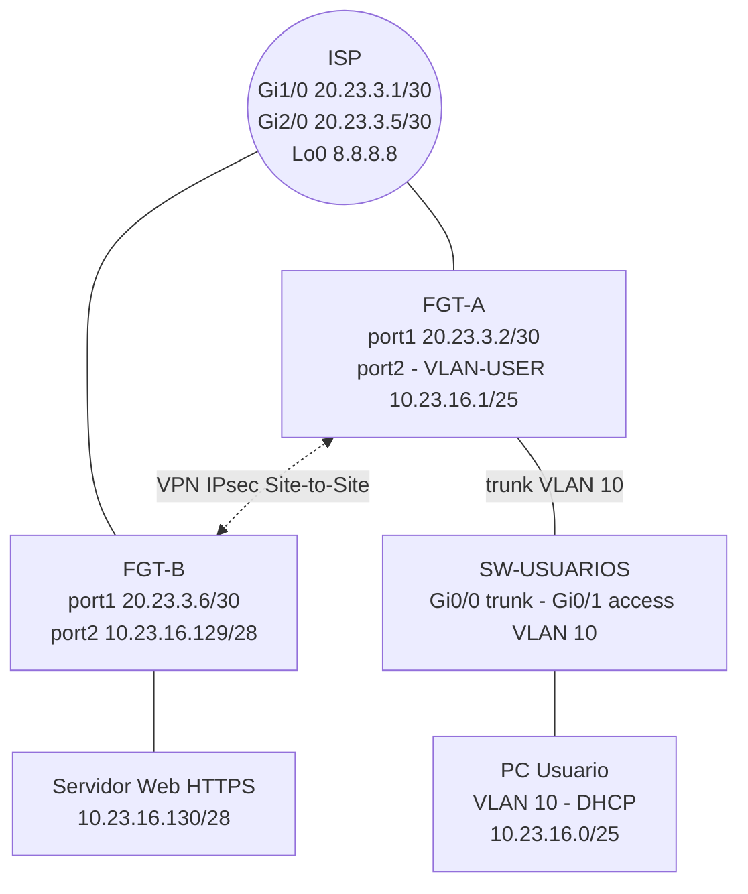

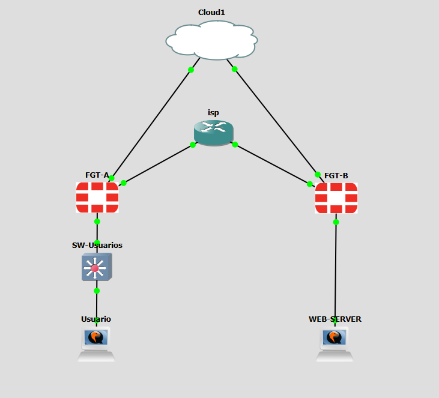

---

## Direccionamiento (basado en mi matrícula 2023-0316)
Usé `20.23.3.x` para las IP públicas y `10.23.16.x` para las redes privadas (20|23 del año, 03|16 del número).

| Equipo | Interfaz | IP / Máscara | Descripción |
|---|---|---|---|
| ISP | Gi1/0 | 20.23.3.1/30 | Enlace hacia FGT-A |
| ISP | Gi2/0 | 20.23.3.5/30 | Enlace hacia FGT-B |
| ISP | Lo0 | 8.8.8.8/32 | Internet simulada (para probar NAT) |
| FGT-A | port1 (WAN) | 20.23.3.2/30 | IP pública Sitio Usuarios |
| FGT-A | VLAN-USER (sobre port2) | 10.23.16.1/25 | Gateway VLAN 10 + DHCP |
| FGT-B | port1 (WAN) | 20.23.3.6/30 | IP pública Sitio Servidor |
| FGT-B | port2 (LAN) | 10.23.16.129/28 | Gateway de servidores |
| Servidor Web | ens3 | 10.23.16.130/28 | HTTPS (Apache) |
| SW-USUARIOS | Gi0/0 / Gi0/1 | – | Trunk hacia FGT-A / Access VLAN 10 hacia el PC |
| PC Usuario | eth0 | DHCP 10.23.16.10 – .120 | VLAN 10 |

---

## Configuración

### 1. ISP y Switch (Cisco)
Configs en [`configs/ISP_running-config.txt`](configs/ISP_running-config.txt) y [`configs/SW-USUARIOS_running-config.txt`](configs/SW-USUARIOS_running-config.txt). El switch lleva la VLAN 10 por trunk hasta el FGT-A y deja el puerto del PC en modo access. El ISP **no tiene rutas hacia 10.23.16.0/24**, solo conoce las IP públicas.

### 2. FGT-A (Sitio Usuarios) – GUI

**Interfaces** – *Network > Interfaces*

| Campo | port1 | VLAN-USER (Create New > Interface) |
|---|---|---|
| Type | Physical | VLAN (Interface: port2, VLAN ID: 10) |
| Role | WAN | LAN |
| IP/Netmask | 20.23.3.2/255.255.255.252 | 10.23.16.1/255.255.255.128 |
| Administrative Access | PING | PING, HTTPS |
| DHCP Server | – | Enabled, rango 10.23.16.10 – 10.23.16.120, Gateway: Same as Interface IP, DNS: 8.8.8.8 |

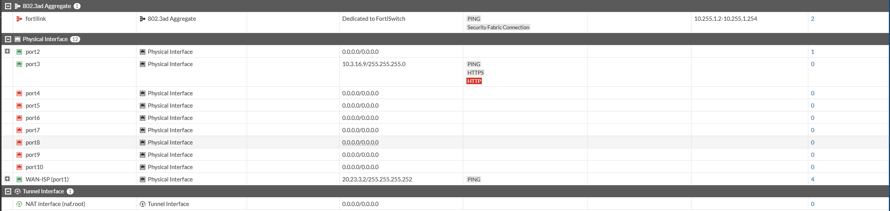
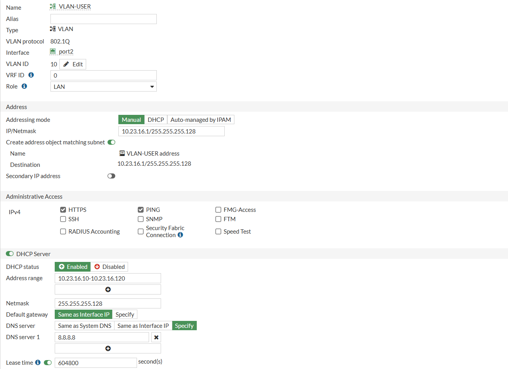

**Ruta por defecto** – *Network > Static Routes > Create New*: Destination `0.0.0.0/0.0.0.0`, Gateway `20.23.3.1`, Interface `port1`.

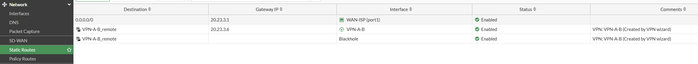

**NAT hacia Internet** – *Policy & Objects > Firewall Policy > Create New*

| Campo | Valor |
|---|---|
| Name | USR-to-INTERNET |
| Incoming Interface | VLAN-USER |
| Outgoing Interface | port1 |
| Source / Destination | all / all |
| Service | ALL |
| NAT | **Enabled** (Use Outgoing Interface Address) |

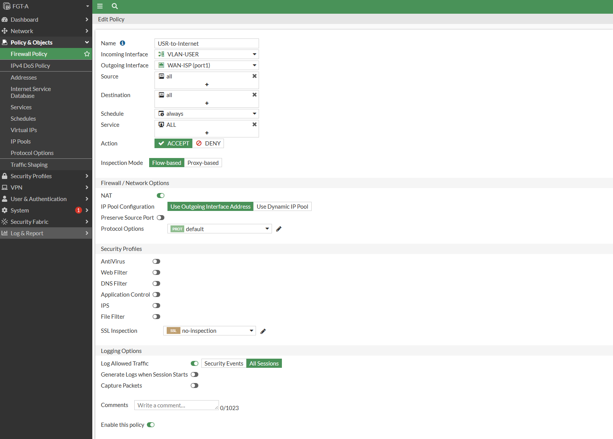

**VPN Site-to-Site** – *VPN > IPsec Wizard*

| Paso | Campo | Valor |
|---|---|---|
| 1 | Name | VPN-A-B |
| 1 | Template type | Site to Site |
| 1 | NAT configuration | No NAT between sites |
| 1 | Remote device type | FortiGate |
| 2 | Remote IP address | 20.23.3.6 |
| 2 | Outgoing interface | port1 |
| 2 | Authentication | Pre-shared Key (la misma en ambos lados) |
| 3 | Local interface | VLAN-USER |
| 3 | Local subnets | 10.23.16.0/25 |
| 3 | Remote subnets | 10.23.16.128/28 |
| 3 | Internet access | None |

El wizard crea solo: la interfaz del túnel, las direcciones, **la ruta estática por el túnel, la ruta blackhole** y las dos políticas (local→remoto y remoto→local) **sin NAT**.

Después, en *VPN > IPsec Tunnels > VPN-A-B > Convert to Custom Tunnel* dejé las propuestas en IKEv2, AES256-SHA256, DH 14 (igual en los dos FortiGate).

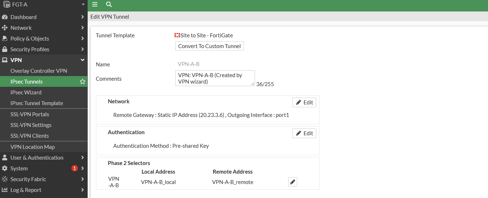
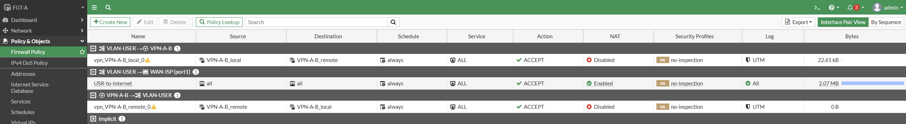
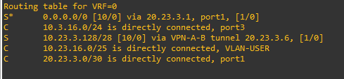

### 3. FGT-B (Sitio Servidor) – GUI
Mismos pasos, cambiando los valores:

| Elemento | Valor |
|---|---|
| port1 | 20.23.3.6/30, Role WAN |
| port2 | 10.23.16.129/28, Role LAN |
| Ruta por defecto | 0.0.0.0/0 → 20.23.3.5 (port1) |
| Política NAT | SRV-to-INTERNET: port2 → port1, NAT enabled |
| VPN Wizard | Name VPN-B-A, Remote IP **20.23.3.2**, Local interface port2, Local subnet 10.23.16.128/28, Remote subnet 10.23.16.0/25 |

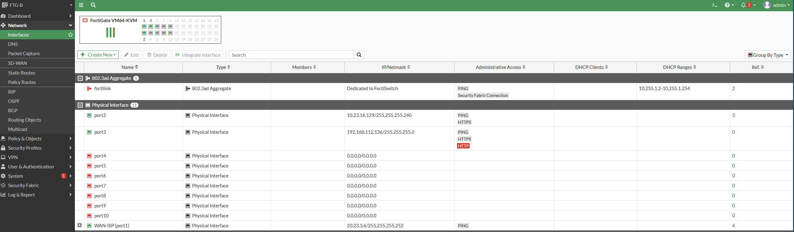
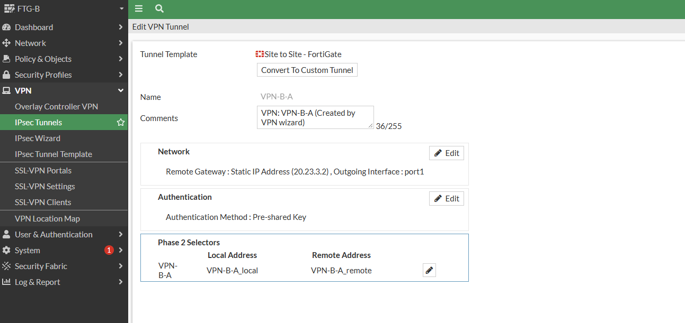

### 4. Servidor Web (Ubuntu Server + Apache)
1. Con el servidor conectado a un nodo NAT instalé los paquetes: `sudo apt update && sudo apt install -y apache2 openssl ufw`.
2. Lo conecté a FGT-B port2 y ejecuté [`scripts/setup_webserver_https.sh`](scripts/setup_webserver_https.sh), que pone la IP fija `10.23.16.130/28`, genera el certificado autofirmado, configura Apache en el puerto 443 y activa el firewall local (ufw).

```bash
sudo bash setup_webserver_https.sh
```

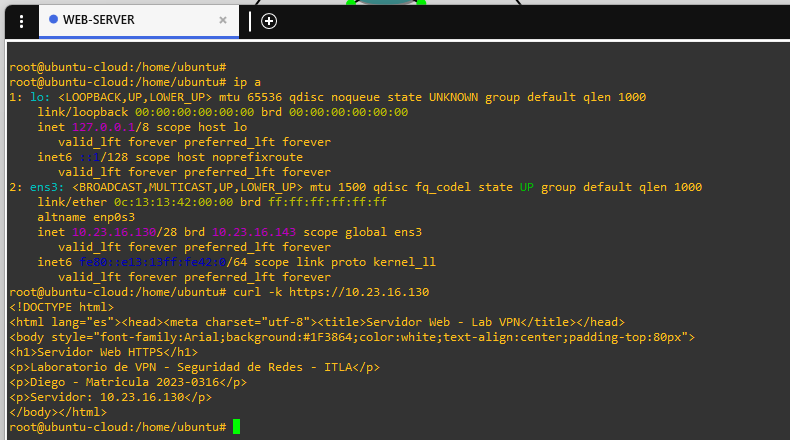

---

## Pruebas

Script de pruebas del usuario: [`scripts/pruebas_usuario.sh`](scripts/pruebas_usuario.sh) (Linux) o [`scripts/pruebas_usuario.bat`](scripts/pruebas_usuario.bat) (Windows).

| # | Prueba | Resultado esperado |
|---|---|---|
| 1 | El PC pide IP por DHCP | Recibe 10.23.16.x/25, gateway 10.23.16.1 |
| 2 | Estado del túnel (*Dashboard > Network > IPsec*) | VPN-A-B **Up** |
| 3 | `ping 10.23.16.130` | Responde |
| 4 | `traceroute -n -I 10.23.16.130` | Saltos: 10.23.16.1 (FGT-A) → 20.23.3.6 (FGT-B, el otro extremo del túnel) → 10.23.16.130. **No aparecen las IP del ISP (20.23.3.1 / 20.23.3.5)**: el ISP no ve los paquetes, solo transporta el túnel cifrado |
| 5 | `https://10.23.16.130` en el navegador | Carga la página (se acepta el certificado autofirmado) |
| 6 | Bajo la VPN (*Network > Interfaces* > túnel VPN-A-B > Status: Disabled) | Túnel **Down** |
| 7 | Repito ping, traceroute y HTTPS | **Fallan**: el tráfico cae en la ruta blackhole y no sale sin cifrar |
| 8 | `ping 8.8.8.8` con la VPN abajo | Funciona gracias al NAT (demuestra que solo se corta lo del servidor) |
| 9 | Subo la VPN otra vez | Todo vuelve a funcionar |

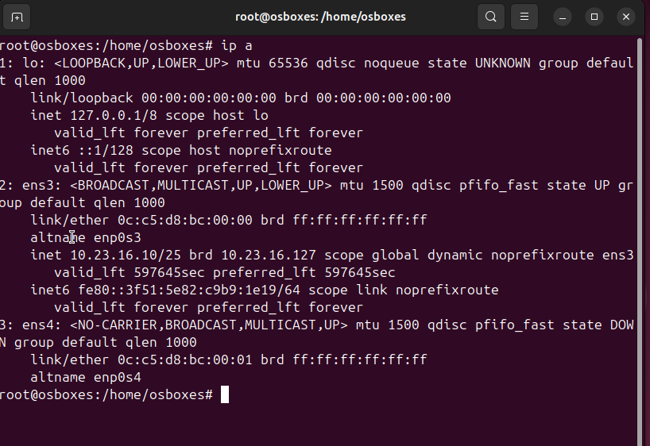
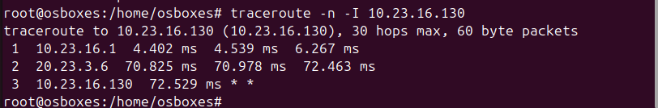
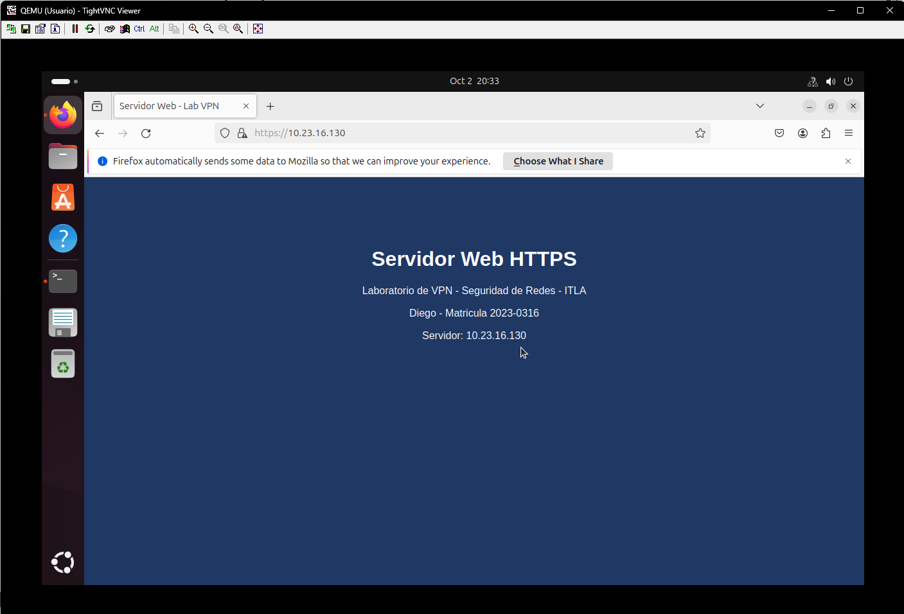
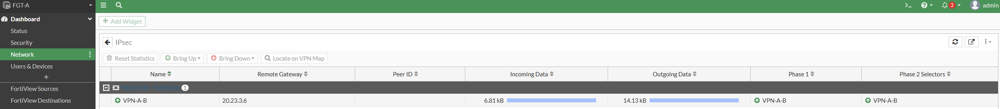
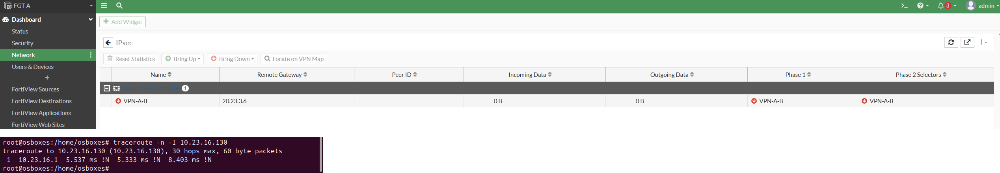

---

## Running-configs
Todo está en la carpeta [`configs/`](configs/):

| Archivo | Equipo |
|---|---|
| `FGT-A_backup.conf` | FortiGate Sitio Usuarios (backup por GUI) |
| `FGT-B_backup.conf` | FortiGate Sitio Servidor (backup por GUI) |
| `ISP_running-config.txt` | Router ISP |
| `SW-USUARIOS_running-config.txt` | Switch de usuarios |

## Estructura del repositorio
```
├── README.md
├── configs/      running-configs y backups
├── diagramas/    topología en Mermaid
├── images/       capturas del laboratorio
└── scripts/      servidor web y pruebas
```

## Conclusión
Con este laboratorio comprobé que la VPN Site-to-Site entre los dos FortiGate protege la comunicación entre el usuario y el servidor. Lo que más me ayudó a entenderlo fue ver el traceroute: con el túnel arriba no aparece ningún salto del ISP, y cuando lo bajo el tráfico simplemente no llega, porque el FortiGate lo manda a la ruta blackhole en vez de sacarlo sin cifrar. También me di cuenta de que las políticas de la VPN van sin NAT, mientras que la salida a internet sí necesita NAT.
